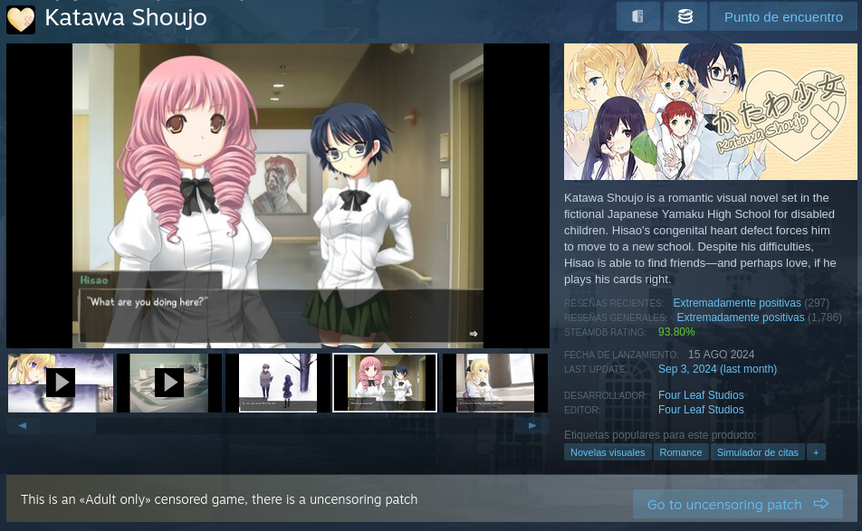

# About

This is the browser extension for [Steam18DB](https://steam18db.com/).
With this extension,
you will see a message each time you enter a steam page of a censored game
with an uncensoring patch available.

Example:

# Installation

On the [Release pages](https://github.com/fcolecumberri/steam18db_extension/releases), download the corresponding add-on for your browser:

- **crx** - [Blink browsers](https://en.wikipedia.org/wiki/Blink_(browser_engine)) (Chromium, Chrome, Opera, Brave, Vivaldi, Maxthon, Microsoft Edge, ...)
- **xpi** - [Gecko browsers](https://en.wikipedia.org/wiki/Gecko_(software)) (Firefox, Librewolf, ...)

## Blink browsers

Just drag and drop inside your browser to install.

## Gecko browsers

Mozilla's security process force the app to be signed and the extension is still in signing process. In theory this can be disable. however, I don't recommend doing that.

Instead, you may download the `.zip`, extract it, then in your browser go into `about:debugging#/runtime/this-firefox`, press the `Load Temporary Add-on…` and select the `manifest.json` file.

If you need to permanently install the extension, Mozilla's security process can be disable (I don't recommend this) in the `about:config` setting `xpinstall.signatures.required` to `false`.

